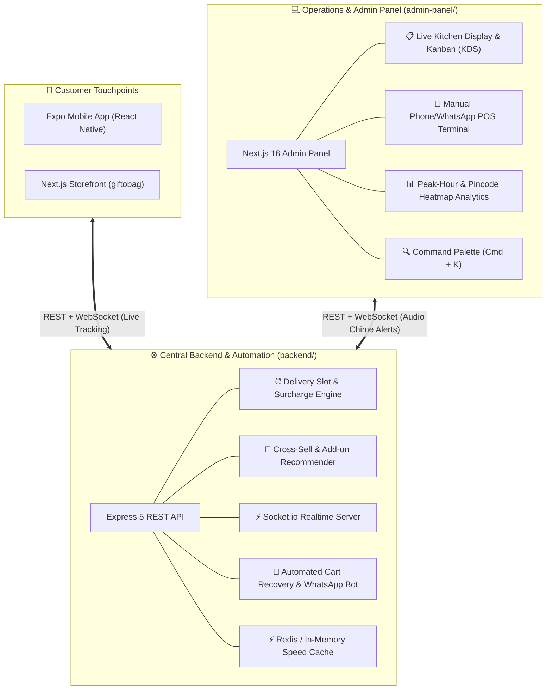

# 🚀 GiftCart / GiftFestive — Complete Ecosystem Upgrade & Innovation Master Plan

**Ecosystem Scope:** Backend API (`backend/`) | Admin Panel (`admin-panel/`) | Mobile App (`mobile/`) | Storefront (`giftobag`)  
**Target Category:** Ultra-Premium Gifting, Cake & Flower E-Commerce (Inspired by FNP, IGP, Bakingo, Swiggy Instamart)  
**Date:** October 2026  
**Status:** Comprehensive Architecture & Roadmap Blueprint  

---

## 📌 1. Current State Assessment & Foundation

Your current platform is already built with a modern stack:
- **Backend (`Node.js + Express 5 + MongoDB + Mongoose`)**: Robust core models (Products with variants, Orders, Coupons, SEO Suite, Twilio WhatsApp, Nodemailer, Cloudinary, AI Chat agent).
- **Admin Panel (`Next.js 16 + React 19 + Tailwind CSS v4`)**: Modern UI layout with dual-panel AI Chat, SEO Suite, Media Manager, Product/Category Catalog, Orders & Inventory tracking.
- **Mobile App (`Expo 55 + React Native 0.83 + React Navigation 6`)**: Native look, OTP Auth, Category & Occasion browsing, Cart, Razorpay & COD Checkout, Celebration Gallery Studio.

### Why Upgrade Now?
To transition from a "standard e-commerce catalog" into an **industry-leading, high-conversion Gifting Powerhouse**, the platform requires specialized gifting dynamics:
1. Time-critical delivery slots (Midnight & Fixed hours).
2. Add-on bundling & cross-sell upsells (Candles, Greeting cards, Chocolates).
3. Personalized photo/message customization.
4. Kitchen Display / Order Kanban for rapid fulfillment.
5. Push notifications & Abandoned Cart automated recovery.
6. Instagram-style Story Highlights & Micro-interactive mobile UX.

---

## 🏗️ 2. Architectural Blueprint & Innovation Roadmap



---

## 💎 3. Detailed Feature Innovations by Platform

---

### Part A: ⚙️ Backend Innovations (`backend/`)

#### 1. Midnight & Exact-Slot Delivery Engine
* **Problem:** Gifts and cakes are heavily ordered for specific celebratory moments (Midnight 12:00 AM, Morning Surprises, Evening Parties).
* **Implementation:**
  - Create `models/DeliverySlot.js`:
    ```javascript
    {
      slotName: "Midnight Delivery (11:00 PM - 11:59 PM)",
      slotType: "midnight", // standard, fixed_time, midnight, early_morning
      startTime: "23:00",
      endTime: "23:59",
      cutoffTime: "20:00", // booking closes at 8 PM for same-day
      extraCharge: 199, // INR
      maxOrdersLimit: 50, // prevent kitchen overload
      activeCities: ["Faridabad", "Delhi", "Gurgaon"]
    }
    ```
  - Slot validation middleware on checkout to verify availability and order capacity.

#### 2. Cake & Gift Customization Attributes
* **Features:**
  - `messageOnCake`: Text input (max 25 chars) e.g., "Happy 25th Rohit ❤️".
  - `cardMessage`: Custom greeting card message with sender & recipient names.
  - `customImageUpload`: Cloudinary upload for photo-cakes, personalized mugs, or photo cushions.
  - `isEggless` surcharge computation (e.g., +₹50 for eggless variant).

#### 3. Real-Time WebSockets (`Socket.io`)
* **Live Features:**
  - `new_order` event: Emits instant sound alert & banner to the Admin Panel.
  - `order_status_change` event: Instantly updates the mobile & web tracking stepper without polling or pulling down to refresh.
  - Live Rider Tracking / Delivery ETA updates.

#### 4. Automated Abandoned Cart Recovery (WhatsApp + Email)
* **High Conversion Booster:**
  - When a user adds items to cart or drops off at checkout without completing payment, a cron job checks abandoned carts after 30 minutes and 24 hours.
  - Automatically dispatches a personalized WhatsApp notification via Twilio:
    > *"Hi Rahul! You left your delicious Red Velvet Cake in your cart 🎂. Complete your order now and enjoy 10% OFF with code `COMEBACK10`! [Link to Cart]"*

#### 5. Pincode Live Serviceability & Distance Pricing
* Dynamic checking of pincodes with:
  - Same-day delivery eligible (Yes/No)
  - Estimated delivery time (e.g. "Express 60-90 Mins" vs "Standard 3 Hours")
  - Distance-based shipping surcharge.

---

### Part B: 💻 Admin Panel Innovations (`admin-panel/`)

#### 1. Kitchen Display & Live Order Kanban Board (`/orders/board`)
* **Inspiration:** Domino's / Swiggy Restaurant Partner dashboard.
* **UI Layout:**
  - 4 interactive drag-and-drop or 1-click transition columns:
    1. **🔔 New Orders** (Flashing indicator + audible notification)
    2. **👨‍🍳 In Preparation / Baking**
    3. **📦 Quality Checked & Packed**
    4. **🛵 Out for Delivery / Assigned**
* **Quick Details on Card:** Delivery Slot badge ("Midnight 11 PM"), Cake Flavor, Message on cake, Countdown timer until delivery deadline.

#### 2. Quick POS (Manual Order Terminal for WhatsApp/Phone Customers)
* Many customers call or WhatsApp directly to book cakes and gifts.
* **POS Features:**
  - 1-page fast order booking: Customer phone search (auto-fills addresses for returning customers).
  - Quick product search & add with variant selector.
  - Choose payment mode: Cash on Delivery or **Generate Instant Razorpay Payment Link** sent directly to the customer's WhatsApp.

#### 3. Visual Command Palette (`Cmd + K` / `Ctrl + K`)
* Keyboard-driven global search across:
  - Search order by ID, customer name, or phone number.
  - Jump directly to any product, category, or settings tab.
  - Quick actions: "Add New Cake", "Download Today's Manifest PDF", "Toggle Store Open/Closed".

#### 4. Gifting Analytics & Pincode Heatmap
* **Revenue Metrics:**
  - Peak Ordering Hours (Heatmap showing hourly spikes).
  - Top Occasions breakdown (Birthdays vs Anniversaries vs Festivals).
  - Delivery Slot revenue contribution (How much revenue came from Midnight delivery surcharges).
  - Add-on attach rate (% of cake orders that purchased candles/flowers).

---

### Part C: 📱 Mobile App Innovations (`mobile/`)

#### 1. Instagram-Style Story Highlights on Home Screen
* Circular story avatars at top of Home Screen with vibrant gradient rings:
  - 🎂 **Midnight Cakes** (Video preview of freshly baked cakes)
  - 🌹 **Fresh Bouquets** (Flower collection preview)
  - 🍫 **Luxury Chocolates**
  - ⚡ **60-Min Express Gifts**
* Tapping opens a fullscreen story viewer with swipe-up "Shop This Product" action.

#### 2. Personalized Occasion Calendar ("Never Forget an Anniversary")
* Built-in reminder manager in user profile:
  - Add loved ones: Mom's Birthday (Oct 14), Anniversary (Dec 22).
  - App sends local push notifications 3 days and 1 day prior:
    > *"Reminder: Sneha's Birthday is in 3 days! Pre-book a midnight surprise cake now."*

#### 3. AI / Interactive Gift Finder Wizard
* "Help Me Choose" floating button:
  1. *Who is it for?* (Partner / Friend / Parents / Kids / Colleague)
  2. *What is the occasion?* (Birthday, Anniversary, Romance, Congratulations)
  3. *Budget Slider:* ₹299 to ₹5,000+
  - Produces an instant, curated gift bundle with 1-click add-to-cart.

#### 4. Interactive "Frequently Bought Together" & Add-on Sheet
* When user clicks "Add to Cart" on a Cake:
  - A bottom sheet slides up smoothly:
    > *"Make it extra special! Add candles, greeting card or party poppers?"*
  - 1-tap micro add buttons with price tags (+₹49, +₹99).

#### 5. Live Tracking Stepper with Delivery Partner Contact
* Real-time order progress timeline:
  - Order Confirmed ➔ Cake in Oven ➔ Ready & Boxed ➔ With Delivery Partner ➔ Delivered.
  - 1-tap call/WhatsApp delivery partner button.

---

### Part D: 🎨 UI / UX & Design System Upgrade (All Platforms)

1. **Aesthetics & Theme:**
   - **Modern Festive Luxury Theme:** Rich berry pink (`#D82B76`), deep midnight navy (`#0B0F19`), champagne gold (`#F59E0B`), and crisp pearl white.
   - Glassmorphism: Frosted glass header bars with backdrop blur (`backdrop-blur-md`).
   - Micro-haptics & Lottie animations: Confetti burst on checkout completion, smooth heart bounce on wishlist, pull-to-refresh spinner with festive gift box icon.

2. **Mobile Bottom Navigation Bar:**
   - Floating pill navigation bar with active icon bounce and notification dots.

---

## 📅 4. Phased Implementation Roadmap

| Phase | Core Objective | Key Deliverables | Estimated Impact |
|---|---|---|---|
| **Phase 1** | **Gifting Essentials & Delivery Engine** | • Midnight & Fixed Slot Delivery System<br/>• Message on Cake & Greeting Card inputs<br/>• Pincode serviceability checker | +35% Average Order Value (AOV) & Midnight margin |
| **Phase 2** | **Add-on Bundling & Upsell System** | • Complementary item recommendations<br/>• "Complete the Surprise" checkout sheet<br/>• Eggless & custom weight pricing | +20% Cart Value from impulse add-ons |
| **Phase 3** | **Real-Time Operations & KDS** | • Socket.io integration for instant alerts<br/>• Admin Live Order Kanban (Kitchen Display)<br/>• Real-time customer order tracking | Reduces order fulfillment delays by 50% |
| **Phase 4** | **Mobile Experience & Visual Delight** | • Story Highlights carousel on Mobile Home<br/>• Interactive Gift Finder Wizard<br/>• Occasion Reminder Calendar | 2x Customer Retention & repeat orders |
| **Phase 5** | **Automated Growth & POS** | • WhatsApp Abandoned Cart auto-recovery<br/>• Quick Admin Phone-Order POS Terminal<br/>• Peak hour and Pincode analytics | Recovers 15-25% of dropped checkouts |

---

## 🛠️ 5. Next Steps & Recommended Starting Point

Since you prefer to tackle enhancements step-by-step:
1. **First recommended step:** Implement **Phase 1 (Midnight & Time-Slot Delivery Engine + Message on Cake / Card customization)** across Backend, Admin, and Mobile.
2. Review this plan file anytime: [`PROJECT_UPGRADE_MASTER_PLAN.md`](file:///e:/giftcart/PROJECT_UPGRADE_MASTER_PLAN.md).
