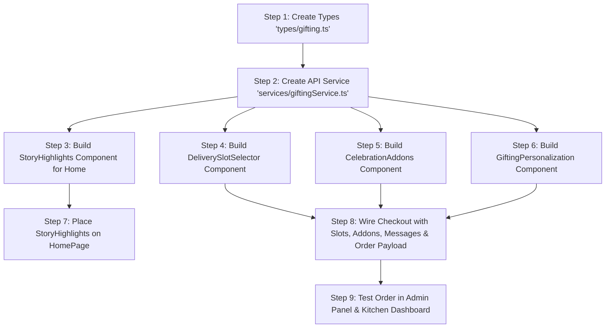

# 🚀 Website (`giftobag` / Storefront) Complete Master Implementation Plan

> **Overview:** This document provides the complete, production-ready blueprint and copy-paste code to integrate all newly implemented features (**Instagram-style Story Highlights**, **Delivery Time Slots & Surcharges**, **Message on Cake & Greeting Cards**, and **Celebration Add-ons Upsell**) into your Next.js Website repository (`giftobag`).
> 
> You can follow this plan step-by-step or **copy this entire markdown file into an AI assistant** (e.g. Cursor, ChatGPT, Claude) working inside your website repository to implement all features seamlessly!

---

## 📌 Table of Contents
1. [System Architecture & Backend API Reference](#1-system-architecture--backend-api-reference)
2. [Step-by-Step Implementation Roadmap](#2-step-by-step-implementation-roadmap)
3. [Step 1: TypeScript Interfaces (`src/types/gifting.ts`)](#step-1-typescript-interfaces)
4. [Step 2: API Service Layer (`src/services/giftingService.ts`)](#step-2-api-service-layer)
5. [Step 3: Instagram-Style Story Highlights (`src/components/StoryHighlights.tsx`)](#step-3-story-highlights-component)
6. [Step 4: Delivery Slot Selector (`src/components/DeliverySlotSelector.tsx`)](#step-4-delivery-slot-selector-component)
7. [Step 5: Celebration Add-ons Upsell (`src/components/CelebrationAddons.tsx`)](#step-5-celebration-add-ons-component)
8. [Step 6: Cake & Card Personalization (`src/components/GiftingPersonalization.tsx`)](#step-6-cake--card-personalization-component)
9. [Step 7: Checkout Screen Full Integration (`src/app/checkout/CheckoutClient.tsx`)](#step-7-checkout-screen-full-integration)
10. [Step 8: Home Screen Integration (`src/app/page.tsx`)](#step-8-home-screen-integration)
11. [Step 9: End-to-End Verification & Testing Checklist](#step-9-end-to-end-verification--testing-checklist)
12. [🤖 One-Click Prompt for External AI Assistants](#10-one-click-prompt-for-external-ai-assistants)

---

## 1. System Architecture & Backend API Reference

The backend already has all the database models, controllers, and routes live and fully operational:

| Feature | HTTP Method | Endpoint | Access | Purpose |
|---|---|---|---|---|
| **Story Highlights** | `GET` | `/api/stories` | Public | Fetches active 9:16 Instagram-style reels for the homepage |
| **Delivery Slots** | `GET` | `/api/delivery-slots` | Public | Fetches delivery windows (Standard, Fixed Time, Midnight, Early Morning) |
| **Celebration Add-ons** | `GET` | `/api/addons` | Public | Fetches extras (Sparkling candles, Birthday cards, Poppers, Chocolates) |
| **Order Placement** | `POST` | `/api/order/create` | User Auth | Creates order with `deliverySlot`, `addons`, `messageOnCake`, and `cardMessage` |

> 🌐 **Backend URL:** Use `process.env.NEXT_PUBLIC_API_URL || "https://giftcartrepo.onrender.com/api"` (or `http://localhost:5000/api` during local development).

---

## 2. Step-by-Step Implementation Roadmap



---

## Step 1: TypeScript Interfaces

Create a new file in your website project:

📁 **File: `src/types/gifting.ts`**
```typescript
export interface DeliverySlot {
  _id: string;
  name: string;
  type: "standard" | "fixed" | "midnight" | "early_morning";
  startTime: string;
  endTime: string;
  timeRange: string;
  extraCharge: number;
  cutoffTime?: string;
  badge?: string;
  maxOrdersPerDay?: number;
  isActive: boolean;
}

export interface AddonItem {
  _id: string;
  name: string;
  category: "candle" | "card" | "chocolate" | "balloon" | "popper" | "teddy" | "accessory";
  price: number;
  image: string;
  description?: string;
  isPopular?: boolean;
  isActive: boolean;
}

export interface StoryItem {
  _id: string;
  title: string;
  subtitle?: string;
  thumbnail?: string;
  mediaUrl: string;
  mediaType?: "image" | "video";
  duration?: number;
  tag?: string;
  ctaText?: string;
  ctaLink?: string;
  sortOrder?: number;
  isActive: boolean;
}

export interface SelectedAddon {
  name: string;
  price: number;
  quantity: number;
  image: string;
  category: string;
}

export interface SelectedDeliverySlot {
  slotName: string;
  slotType: string;
  timeRange: string;
  extraCharge: number;
  deliveryDate?: string;
}
```

---

## Step 2: API Service Layer

Create an API service layer to fetch data from the backend:

📁 **File: `src/services/giftingService.ts`**
```typescript
import axios from "axios";
import { DeliverySlot, AddonItem, StoryItem } from "@/types/gifting";

const API_BASE = process.env.NEXT_PUBLIC_API_URL || "https://giftcartrepo.onrender.com/api";

export const getDeliverySlots = async (): Promise<DeliverySlot[]> => {
  try {
    const res = await axios.get(`${API_BASE}/delivery-slots`);
    return res.data?.data || res.data || [];
  } catch (err) {
    console.error("Failed to fetch delivery slots:", err);
    return [];
  }
};

export const getAddons = async (): Promise<AddonItem[]> => {
  try {
    const res = await axios.get(`${API_BASE}/addons`);
    return res.data?.data || res.data || [];
  } catch (err) {
    console.error("Failed to fetch celebration add-ons:", err);
    return [];
  }
};

export const getStories = async (): Promise<StoryItem[]> => {
  try {
    const res = await axios.get(`${API_BASE}/stories`);
    return res.data?.data || res.data || [];
  } catch (err) {
    console.error("Failed to fetch story highlights:", err);
    return [];
  }
};
```

---

## Step 3: Story Highlights Component

This component renders the Instagram-style story circles at the top of the homepage and opens an interactive 9:16 lightbox with auto-advancing progress timers when clicked:

📁 **File: `src/components/StoryHighlights.tsx`**
```tsx
"use client";

import React, { useEffect, useState, useRef } from "react";
import Link from "next/link";
import { StoryItem } from "@/types/gifting";
import { getStories } from "@/services/giftingService";
import { X, ChevronLeft, ChevronRight, ExternalLink } from "lucide-react";

export default function StoryHighlights() {
  const [stories, setStories] = useState<StoryItem[]>([]);
  const [activeStoryIndex, setActiveStoryIndex] = useState<number | null>(null);
  const [progress, setProgress] = useState(0);
  const timerRef = useRef<NodeJS.Timeout | null>(null);

  useEffect(() => {
    getStories().then(setStories);
  }, []);

  const current = activeStoryIndex !== null ? stories[activeStoryIndex] : null;

  // Auto-progress timer for current story
  useEffect(() => {
    if (activeStoryIndex === null || !current) return;

    setProgress(0);
    const duration = (current.duration || 5) * 1000;
    const intervalMs = 50;
    const step = (intervalMs / duration) * 100;

    timerRef.current = setInterval(() => {
      setProgress((prev) => {
        if (prev >= 100) {
          handleNext();
          return 0;
        }
        return prev + step;
      });
    }, intervalMs);

    return () => {
      if (timerRef.current) clearInterval(timerRef.current);
    };
  }, [activeStoryIndex, current]);

  const handleNext = () => {
    if (activeStoryIndex === null) return;
    if (activeStoryIndex < stories.length - 1) {
      setActiveStoryIndex(activeStoryIndex + 1);
    } else {
      setActiveStoryIndex(null); // Close on last story
    }
  };

  const handlePrev = () => {
    if (activeStoryIndex === null) return;
    if (activeStoryIndex > 0) {
      setActiveStoryIndex(activeStoryIndex - 1);
    }
  };

  if (!stories || stories.length === 0) return null;

  return (
    <section className="py-4 border-b border-border/40 bg-background/50">
      <div className="max-w-7xl mx-auto px-4">
        {/* Story Circle Highlights Row */}
        <div className="flex items-center gap-4 overflow-x-auto pb-2 scrollbar-none">
          {stories.map((story, idx) => {
            const displayImg = story.thumbnail || story.mediaUrl;
            return (
              <button
                key={story._id || idx}
                onClick={() => setActiveStoryIndex(idx)}
                className="flex flex-col items-center gap-1.5 group shrink-0 focus:outline-none cursor-pointer"
              >
                <div className="p-0.5 rounded-full bg-gradient-to-tr from-pink-500 via-rose-500 to-amber-500 group-hover:scale-105 transition-transform duration-200">
                  <div className="p-0.5 rounded-full bg-background">
                     {
                        (e.target as any).src =
                          "https://images.unsplash.com/photo-1535141192574-5d4897c13136?w=300";
                      }}
                    />
                  </div>
                </div>
                <span className="text-xs font-semibold text-foreground/80 group-hover:text-pink-600 transition line-clamp-1 max-w-[76px] text-center">
                  {story.title}
                </span>
              </button>
            );
          })}
        </div>
      </div>

      {/* Full-Screen Instagram-Style Lightbox Modal */}
      {current && (
        <div className="fixed inset-0 z-50 flex items-center justify-center bg-black/90 backdrop-blur-md p-4 animate-in fade-in duration-200">
          <div className="relative w-full max-w-sm aspect-[9/16] bg-slate-950 rounded-3xl overflow-hidden shadow-2xl border-4 border-slate-900 flex flex-col justify-between p-3.5">
            {/* Story Media Photo/Video */}
            
            <div className="absolute inset-0 bg-gradient-to-b from-black/80 via-transparent to-black/90 pointer-events-none" />

            {/* Top Multi-Segment Progress Bars */}
            <div className="relative z-20 space-y-2">
              <div className="flex gap-1.5">
                {stories.map((_, i) => (
                  <div key={i} className="h-1 flex-1 bg-white/30 rounded-full overflow-hidden">
                    <div
                      className="h-full bg-white transition-all"
                      style={{
                        width:
                          i < (activeStoryIndex ?? 0)
                            ? "100%"
                            : i === activeStoryIndex
                            ? `${progress}%`
                            : "0%",
                      }}
                    />
                  </div>
                ))}
              </div>

              {/* Top Header with Brand & Tag */}
              <div className="flex items-center justify-between">
                <div className="flex items-center gap-2">
                  <div className="w-6 h-6 rounded-full bg-gradient-to-tr from-pink-500 to-amber-500 flex items-center justify-center text-[10px] text-white font-black">
                    GF
                  </div>
                  <span className="text-white text-xs font-bold drop-shadow">GiftCart</span>
                  {current.tag && (
                    <span className="text-[9px] bg-pink-600 text-white font-black px-2 py-0.5 rounded-full shadow-xs">
                      {current.tag}
                    </span>
                  )}
                </div>
                <button
                  onClick={() => setActiveStoryIndex(null)}
                  className="p-1.5 bg-black/50 text-white rounded-full hover:bg-black/80 cursor-pointer"
                >
                  <X className="w-4 h-4" />
                </button>
              </div>
            </div>

            {/* Navigation Click Zones */}
            <div className="absolute inset-y-16 inset-x-0 z-10 flex">
              <div className="w-1/2 h-full cursor-pointer" onClick={handlePrev} />
              <div className="w-1/2 h-full cursor-pointer" onClick={handleNext} />
            </div>

            {/* Left & Right Chevron Arrows */}
            {activeStoryIndex > 0 && (
              <button
                onClick={handlePrev}
                className="absolute left-2 top-1/2 -translate-y-1/2 z-20 p-2 rounded-full bg-black/40 text-white hover:bg-black/70 cursor-pointer"
              >
                <ChevronLeft className="w-4 h-4" />
              </button>
            )}
            {activeStoryIndex < stories.length - 1 && (
              <button
                onClick={handleNext}
                className="absolute right-2 top-1/2 -translate-y-1/2 z-20 p-2 rounded-full bg-black/40 text-white hover:bg-black/70 cursor-pointer"
              >
                <ChevronRight className="w-4 h-4" />
              </button>
            )}

            {/* Bottom Story Info & Call to Action */}
            <div className="relative z-20 space-y-2">
              <div>
                <h3 className="text-white font-black text-sm drop-shadow leading-tight">
                  {current.title}
                </h3>
                {current.subtitle && (
                  <p className="text-white/80 text-[11px] mt-0.5 drop-shadow line-clamp-2">
                    {current.subtitle}
                  </p>
                )}
              </div>

              <Link
                href={current.ctaLink || "/products"}
                onClick={() => setActiveStoryIndex(null)}
                className="w-full py-2.5 px-4 rounded-xl bg-white text-slate-900 font-black text-xs flex items-center justify-center gap-1.5 shadow-xl hover:bg-slate-100 transition"
              >
                <span>{current.ctaText || "Order Now"}</span>
                <ExternalLink className="w-3.5 h-3.5" />
              </Link>
            </div>
          </div>
        </div>
      )}
    </section>
  );
}
```

---

## Step 4: Delivery Slot Selector Component

Provides customer selection between Standard, Fixed Time, Midnight, and Early Morning delivery windows, with live surcharge calculations:

📁 **File: `src/components/DeliverySlotSelector.tsx`**
```tsx
"use client";

import React, { useEffect, useState } from "react";
import { DeliverySlot } from "@/types/gifting";
import { getDeliverySlots } from "@/services/giftingService";
import { Clock, Moon, Sun, Zap, CheckCircle2 } from "lucide-react";

interface Props {
  selectedSlot: DeliverySlot | null;
  onSelectSlot: (slot: DeliverySlot) => void;
}

export default function DeliverySlotSelector({ selectedSlot, onSelectSlot }: Props) {
  const [slots, setSlots] = useState<DeliverySlot[]>([]);
  const [loading, setLoading] = useState(true);

  useEffect(() => {
    getDeliverySlots().then((data) => {
      setSlots(data);
      if (data.length > 0 && !selectedSlot) {
        onSelectSlot(data[0]); // default to first slot (Standard)
      }
      setLoading(false);
    });
  }, []);

  const getSlotIcon = (type: string) => {
    switch (type) {
      case "midnight":
        return <Moon className="w-4 h-4 text-purple-500" />;
      case "early_morning":
        return <Zap className="w-4 h-4 text-emerald-500" />;
      case "fixed":
        return <Clock className="w-4 h-4 text-amber-500" />;
      default:
        return <Sun className="w-4 h-4 text-blue-500" />;
    }
  };

  if (loading) {
    return <div className="text-xs text-muted-foreground py-2">Loading delivery windows...</div>;
  }

  return (
    <div className="space-y-3">
      <div className="flex items-center justify-between">
        <label className="text-sm font-bold text-foreground flex items-center gap-2">
          <Clock className="w-4 h-4 text-primary" />
          Choose Delivery Time Slot
        </label>
        <span className="text-[11px] text-muted-foreground">Select preferred arrival window</span>
      </div>

      <div className="grid grid-cols-1 sm:grid-cols-2 gap-3">
        {slots.map((slot) => {
          const isSelected = selectedSlot?._id === slot._id;

          return (
            <button
              type="button"
              key={slot._id}
              onClick={() => onSelectSlot(slot)}
              className={`p-3.5 rounded-2xl border text-left transition-all duration-200 relative flex items-start justify-between cursor-pointer ${
                isSelected
                  ? "border-primary bg-primary/5 ring-2 ring-primary/20 shadow-xs"
                  : "border-border bg-card hover:border-primary/40"
              }`}
            >
              <div className="space-y-1">
                <div className="flex items-center gap-2">
                  <div className="p-1.5 rounded-lg bg-background border border-border">
                    {getSlotIcon(slot.type)}
                  </div>
                  <span className="text-xs font-bold text-foreground">{slot.name}</span>
                </div>
                <p className="text-[11px] text-muted-foreground">Timing: {slot.timeRange}</p>
                {slot.badge && (
                  <span className="inline-block text-[9px] font-bold px-2 py-0.5 rounded-md bg-amber-500/10 text-amber-600 border border-amber-500/20">
                    ★ {slot.badge}
                  </span>
                )}
                {slot.cutoffTime && (
                  <p className="text-[10px] text-slate-400">{slot.cutoffTime}</p>
                )}
              </div>

              <div className="text-right shrink-0">
                <span
                  className={`text-xs font-extrabold ${
                    slot.extraCharge > 0 ? "text-amber-600 dark:text-amber-400" : "text-emerald-600"
                  }`}
                >
                  {slot.extraCharge > 0 ? `+₹${slot.extraCharge}` : "FREE"}
                </span>
                {isSelected && <CheckCircle2 className="w-4 h-4 text-primary ml-auto mt-2" />}
              </div>
            </button>
          );
        })}
      </div>
    </div>
  );
}
```

---

## Step 5: Celebration Add-ons Component

Shows sparkling candles, customized greeting cards, party poppers, chocolates, and teddy bears right before checkout:

📁 **File: `src/components/CelebrationAddons.tsx`**
```tsx
"use client";

import React, { useEffect, useState } from "react";
import { AddonItem, SelectedAddon } from "@/types/gifting";
import { getAddons } from "@/services/giftingService";
import { Gift, Plus, Check, Flame } from "lucide-react";

interface Props {
  selectedAddons: SelectedAddon[];
  onToggleAddon: (addon: AddonItem) => void;
}

export default function CelebrationAddons({ selectedAddons, onToggleAddon }: Props) {
  const [addons, setAddons] = useState<AddonItem[]>([]);

  useEffect(() => {
    getAddons().then(setAddons);
  }, []);

  if (!addons || addons.length === 0) return null;

  return (
    <div className="space-y-3">
      <div className="flex items-center justify-between">
        <label className="text-sm font-bold text-foreground flex items-center gap-2">
          <Gift className="w-4 h-4 text-rose-500" />
          Make it Extra Special (Celebration Add-ons)
        </label>
        <span className="text-xs text-muted-foreground">Optional Extras</span>
      </div>

      <div className="flex gap-3 overflow-x-auto pb-2 scrollbar-none">
        {addons.map((addon) => {
          const isSelected = selectedAddons.some((a) => a.name === addon.name);

          return (
            <div
              key={addon._id}
              className={`w-36 shrink-0 bg-card border rounded-2xl overflow-hidden flex flex-col justify-between transition-all ${
                isSelected
                  ? "border-rose-500 ring-2 ring-rose-500/20 shadow-xs"
                  : "border-border hover:border-rose-500/40"
              }`}
            >
              <div className="aspect-square bg-slate-50 dark:bg-slate-900 overflow-hidden relative p-2">
                 {
                    (e.target as any).src =
                      "https://images.unsplash.com/photo-1530103862676-de8c9debad1d?w=300";
                  }}
                />
                {addon.isPopular && (
                  <span className="absolute top-1.5 left-1.5 flex items-center gap-0.5 text-[8px] font-black px-1.5 py-0.5 rounded-full bg-amber-500 text-slate-950 shadow-xs">
                    <Flame className="w-2.5 h-2.5 fill-slate-950" />
                    BESTSELLER
                  </span>
                )}
              </div>

              <div className="p-2.5">
                <p className="text-xs font-bold text-foreground truncate">{addon.name}</p>
                <p className="text-xs font-black text-rose-600 mt-0.5">+₹{addon.price}</p>

                <button
                  type="button"
                  onClick={() => onToggleAddon(addon)}
                  className={`w-full mt-2 py-1.5 rounded-xl text-xs font-bold transition flex items-center justify-center gap-1 cursor-pointer ${
                    isSelected
                      ? "bg-rose-500 text-white shadow-xs"
                      : "bg-muted text-foreground hover:bg-rose-500 hover:text-white"
                  }`}
                >
                  {isSelected ? (
                    <>
                      <Check className="w-3.5 h-3.5" /> Added
                    </>
                  ) : (
                    <>
                      <Plus className="w-3.5 h-3.5" /> Add
                    </>
                  )}
                </button>
              </div>
            </div>
          );
        })}
      </div>
    </div>
  );
}
```

---

## Step 6: Cake & Card Personalization Component

Enables customers to write text on the cake and a free heartfelt greeting card message:

📁 **File: `src/components/GiftingPersonalization.tsx`**
```tsx
"use client";

import React from "react";
import { Heart, Sparkles } from "lucide-react";

interface Props {
  messageOnCake: string;
  setMessageOnCake: (val: string) => void;
  cardMessage: string;
  setCardMessage: (val: string) => void;
  senderName: string;
  setSenderName: (val: string) => void;
  recipientName: string;
  setRecipientName: (val: string) => void;
}

export default function GiftingPersonalization({
  messageOnCake,
  setMessageOnCake,
  cardMessage,
  setCardMessage,
  senderName,
  setSenderName,
  recipientName,
  setRecipientName,
}: Props) {
  return (
    <div className="bg-card border border-border rounded-3xl p-5 sm:p-6 space-y-4 shadow-xs">
      <div className="flex items-center gap-2 pb-3 border-b border-border">
        <Heart className="w-4 h-4 text-rose-500 fill-rose-500" />
        <h3 className="font-bold text-sm text-foreground">Cake & Greeting Card Personalization</h3>
      </div>

      {/* Message on Cake */}
      <div>
        <div className="flex items-center justify-between mb-1.5">
          <label className="text-xs font-bold text-foreground">
            🎂 Message on Cake
          </label>
          <span className="text-[10px] text-muted-foreground">
            {messageOnCake.length}/25 chars
          </span>
        </div>
        <input
          type="text"
          maxLength={25}
          placeholder="e.g. Happy Birthday Rohit ❤️"
          value={messageOnCake}
          onChange={(e) => setMessageOnCake(e.target.value)}
          className="w-full px-3.5 py-2.5 rounded-2xl border border-border bg-background text-sm text-foreground focus:outline-none focus:ring-2 focus:ring-primary/20"
        />
      </div>

      {/* Greeting Card Message */}
      <div>
        <label className="text-xs font-bold text-foreground block mb-1.5">
          💌 Free Greeting Card Wish
        </label>
        <textarea
          rows={2}
          placeholder="Write your personal heart-touching message for the recipient..."
          value={cardMessage}
          onChange={(e) => setCardMessage(e.target.value)}
          className="w-full px-3.5 py-2.5 rounded-2xl border border-border bg-background text-sm text-foreground focus:outline-none focus:ring-2 focus:ring-primary/20"
        />
      </div>

      {/* Sender & Recipient */}
      <div className="grid grid-cols-2 gap-3 pt-1">
        <div>
          <label className="text-[11px] font-bold text-muted-foreground block mb-1">Sender Name</label>
          <input
            type="text"
            placeholder="e.g. Pooja"
            value={senderName}
            onChange={(e) => setSenderName(e.target.value)}
            className="w-full px-3 py-2 rounded-xl border border-border bg-background text-xs text-foreground focus:outline-none focus:ring-2 focus:ring-primary/20"
          />
        </div>
        <div>
          <label className="text-[11px] font-bold text-muted-foreground block mb-1">Recipient Name</label>
          <input
            type="text"
            placeholder="e.g. Rahul"
            value={recipientName}
            onChange={(e) => setRecipientName(e.target.value)}
            className="w-full px-3 py-2 rounded-xl border border-border bg-background text-xs text-foreground focus:outline-none focus:ring-2 focus:ring-primary/20"
          />
        </div>
      </div>
    </div>
  );
}
```

---

## Step 7: Checkout Screen Full Integration

In your website checkout page (`src/app/checkout/CheckoutClient.tsx` or `page.tsx`):

```tsx
import DeliverySlotSelector from "@/components/DeliverySlotSelector";
import CelebrationAddons from "@/components/CelebrationAddons";
import GiftingPersonalization from "@/components/GiftingPersonalization";
import { DeliverySlot, SelectedAddon, AddonItem } from "@/types/gifting";

export default function CheckoutClient() {
  // 1. Gifting States
  const [selectedSlot, setSelectedSlot] = useState<DeliverySlot | null>(null);
  const [selectedAddons, setSelectedAddons] = useState<SelectedAddon[]>([]);
  const [messageOnCake, setMessageOnCake] = useState("");
  const [cardMessage, setCardMessage] = useState("");
  const [senderName, setSenderName] = useState("");
  const [recipientName, setRecipientName] = useState("");

  // 2. Add-on Toggle Handler
  const handleToggleAddon = (addon: AddonItem) => {
    setSelectedAddons((prev) => {
      const exists = prev.find((a) => a.name === addon.name);
      if (exists) return prev.filter((a) => a.name !== addon.name);
      return [
        ...prev,
        {
          name: addon.name,
          price: addon.price,
          quantity: 1,
          image: addon.image,
          category: addon.category,
        },
      ];
    });
  };

  // 3. Exact Price Calculation matching backend formula
  const itemsSubtotal = cartItems.reduce((acc, item) => acc + item.itemTotal, 0);
  const slotExtra = Number(selectedSlot?.extraCharge || 0);
  const addonsTotal = selectedAddons.reduce((acc, a) => acc + a.price * a.quantity, 0);
  const grandTotal = itemsSubtotal + slotExtra + addonsTotal - couponDiscount;

  // 4. Order Creation POST Payload
  const handleCreateOrder = async () => {
    const payload = {
      items: cartItems,
      shippingAddress,
      paymentMethod,
      couponCode,
      deliverySlot: selectedSlot
        ? {
            slotName: selectedSlot.name,
            slotType: selectedSlot.type,
            timeRange: selectedSlot.timeRange,
            extraCharge: selectedSlot.extraCharge,
          }
        : undefined,
      messageOnCake,
      cardMessage,
      senderName,
      recipientName,
      addons: selectedAddons,
    };

    const res = await axios.post(`${API_BASE}/order/create`, payload, {
      headers: { Authorization: `Bearer ${token}` },
    });
    // Redirect to Order Success / Payment
  };

  return (
    <div className="space-y-6">
      {/* Step A: Delivery Slot */}
      <DeliverySlotSelector
        selectedSlot={selectedSlot}
        onSelectSlot={setSelectedSlot}
      />

      {/* Step B: Cake & Card Personalization */}
      <GiftingPersonalization
        messageOnCake={messageOnCake}
        setMessageOnCake={setMessageOnCake}
        cardMessage={cardMessage}
        setCardMessage={setCardMessage}
        senderName={senderName}
        setSenderName={setSenderName}
        recipientName={recipientName}
        setRecipientName={setRecipientName}
      />

      {/* Step C: Celebration Add-ons Upsell */}
      <CelebrationAddons
        selectedAddons={selectedAddons}
        onToggleAddon={handleToggleAddon}
      />

      {/* Step D: Bill Breakdown with Slot & Add-on lines */}
      <div className="p-4 rounded-2xl bg-card border border-border space-y-2 text-sm">
        <div className="flex justify-between">
          <span>Items Subtotal:</span>
          <span>₹{itemsSubtotal}</span>
        </div>
        {slotExtra > 0 && (
          <div className="flex justify-between text-amber-600 font-semibold">
            <span>Delivery Slot Surcharge ({selectedSlot?.name}):</span>
            <span>+₹{slotExtra}</span>
          </div>
        )}
        {addonsTotal > 0 && (
          <div className="flex justify-between text-rose-600 font-semibold">
            <span>Celebration Add-ons ({selectedAddons.length}):</span>
            <span>+₹{addonsTotal}</span>
          </div>
        )}
        <div className="flex justify-between font-black text-base pt-2 border-t border-border">
          <span>Total Payable:</span>
          <span>₹{grandTotal}</span>
        </div>
      </div>
    </div>
  );
}
```

---

## Step 8: Home Screen Integration

In your homepage (`src/app/page.tsx` or `HomeClient.tsx`), place the `StoryHighlights` component at the very top:

```tsx
import StoryHighlights from "@/components/StoryHighlights";

export default function HomePage() {
  return (
    <main>
      {/* ── 1. Instagram-Style Story Highlights Reel ── */}
      <StoryHighlights />

      {/* ── 2. Your Existing Hero Banners & Categories ── */}
      <HeroBannerSection />
      
      {/* ── 3. Rest of your storefront ── */}
    </main>
  );
}
```

---

## Step 9: End-to-End Verification & Testing Checklist

| # | Action to Verify | Expected Result |
|---|---|---|
| 1 | Open Admin Panel `/stories` & publish a story with 9:16 image | Story circle appears at top of website homepage within seconds |
| 2 | Click on the story circle on website | Full-screen 9:16 reel lightbox opens with auto-timer & CTA button |
| 3 | Go to Website Checkout page | Delivery slots load dynamically from backend with correct badges & prices |
| 4 | Select a "Midnight Surprise (+₹250)" slot | Bill summary updates live: `+₹250` added to grand total |
| 5 | Click "+ Add" on Magic Sparkling Candles (`+₹99`) | Candle added, bill summary updates: `+₹99` added to grand total |
| 6 | Type "Happy Birthday Rohit ❤️" in Message on Cake | Counter updates (`24/25 chars`), stored in state |
| 7 | Place Order | Order saved in MongoDB with `deliverySlot`, `addons`, and `messageOnCake` |
| 8 | Open Admin Panel `/orders` | Order shows up with delivery slot badge, addons list, and cake message |
| 9 | Open Admin Panel `/kitchen` | Order appears in real-time under "Received" tab with cake instructions |

---

## 🤖 One-Click Prompt for External AI Assistants

> **Copy and paste the text block below into your AI assistant working on the website repository:**

```markdown
Please implement the Gifting Storefront upgrade into this Next.js website repository following this exact plan:

1. Create `src/types/gifting.ts` with `DeliverySlot`, `AddonItem`, `StoryItem`, and `SelectedAddon`.
2. Create `src/services/giftingService.ts` to call:
   - `GET /api/delivery-slots`
   - `GET /api/addons`
   - `GET /api/stories`
   (Base URL: process.env.NEXT_PUBLIC_API_URL || 'https://giftcartrepo.onrender.com/api')
3. Create `src/components/StoryHighlights.tsx`:
   - An Instagram-style story circle highlight row for the homepage.
   - Click opens a 9:16 vertical full-screen modal with multi-segment progress timers and CTA order buttons.
   - Insert this at the top of `src/app/page.tsx`.
4. Create `src/components/DeliverySlotSelector.tsx`:
   - Allows choosing Standard (Free), Fixed, Midnight, or Early Morning slots.
5. Create `src/components/CelebrationAddons.tsx`:
   - Horizontal carousel of extras (candles, cards, chocolates, poppers) with '+ Add' toggle.
6. Create `src/components/GiftingPersonalization.tsx`:
   - Message on Cake input (max 25 chars) and Greeting Card textarea.
7. Integrate components into Checkout (`src/app/checkout`):
   - Update Grand Total: `itemsSubtotal + slotExtra + addonsTotal - couponDiscount`.
   - Pass `deliverySlot`, `addons`, `messageOnCake`, and `cardMessage` into the `POST /api/order/create` payload.

Refer to WEBSITE_INTEGRATION_GUIDE.md in the repo for exact copy-paste code snippets.
```
