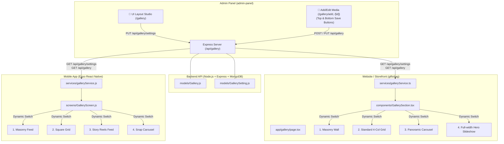

# 📸 Complete Gallery System Architecture & Website Integration Plan

## 📌 Executive Summary
This document provides the complete, production-ready blueprint for the **Celebration & Moments Gallery** system across the entire ecosystem:
1. **Backend REST API**: Complete CRUD, settings configuration, auto-seeding, likes counter, product linking ("Shop This Look"), and categories.
2. **Admin Panel UI Studio**: Dedicated full-page views, top & bottom Save buttons, and a **Multi-Platform UI Layout Studio** that controls the UI design dynamically for both Mobile and Website.
3. **Website Integration (`giftobag` / Web Storefront)**: Complete guide with TypeScript interfaces, API service, dynamic layout renderer (Masonry Wall, Standard Grid, Panoramic Carousel, Full-width Slideshow), and Lightbox modal.
4. **Mobile App (Expo / React Native)**: 4 dynamic layouts (Masonry Feed, Square Grid, Reels Feed, Snap Carousel), instant like animation, and direct catalog checkout.

---

## 🏗️ 1. Multi-Platform System Architecture



---

## 🗄️ 2. Database Models & Backend API

### 2.1. Gallery Item Model (`backend/models/Gallery.js`)
```javascript
const mongoose = require("mongoose");

const gallerySchema = new mongoose.Schema(
  {
    title: { type: String, required: true, trim: true },
    caption: { type: String, trim: true, default: "" },
    image: { type: String, required: true, trim: true },
    mediaType: { type: String, enum: ["image", "video"], default: "image" },
    videoUrl: { type: String, trim: true, default: "" },
    category: { type: String, default: "Celebrations", trim: true },
    tags: [{ type: String, trim: true }],
    likes: { type: Number, default: 0, min: 0 },
    order: { type: Number, default: 0 },
    isFeatured: { type: Boolean, default: false },
    isActive: { type: Boolean, default: true },
    linkedProduct: {
      type: mongoose.Schema.Types.ObjectId,
      ref: "Product",
      default: null,
    },
    date: { type: Date, default: Date.now },
  },
  { timestamps: true }
);

module.exports = mongoose.model("Gallery", gallerySchema);
```

### 2.2. Gallery Settings Model (`backend/models/GallerySetting.js`)
```javascript
const mongoose = require("mongoose");

const gallerySettingSchema = new mongoose.Schema(
  {
    key: { type: String, default: "default_gallery_settings", unique: true },
    mobileLayout: {
      type: String,
      enum: ["masonry", "grid", "feed", "carousel"],
      default: "masonry",
    },
    webLayout: {
      type: String,
      enum: ["masonry", "grid", "carousel", "slideshow"],
      default: "masonry",
    },
    title: { type: String, default: "Moments of Joy 📸", trim: true },
    subtitle: { type: String, default: "Real customer celebrations & deliveries", trim: true },
    enableLikes: { type: Boolean, default: true },
    enableShopLook: { type: Boolean, default: true },
    itemsPerPage: { type: Number, default: 12 },
  },
  { timestamps: true }
);

module.exports = mongoose.model("GallerySetting", gallerySettingSchema);
```

### 2.3. REST API Endpoints

| Method | Endpoint | Access | Purpose |
| :--- | :--- | :--- | :--- |
| `GET` | `/api/gallery/settings` | **Public** | Fetch dynamic layout settings for Web & Mobile |
| `PUT` | `/api/gallery/settings` | **Admin Only** | Update layout styles (`webLayout`, `mobileLayout`, toggles) |
| `GET` | `/api/gallery` | **Public** | Get items (`page`, `limit`, `category`, `mediaType`, `search`) |
| `GET` | `/api/gallery/categories`| **Public** | List of all distinct active categories |
| `GET` | `/api/gallery/:id` | **Public** | Single item details with populated `linkedProduct` |
| `POST`| `/api/gallery/:id/like` | **Public** | Increment like counter |
| `POST`| `/api/gallery` | **Admin Only** | Create new gallery item |
| `PUT` | `/api/gallery/:id` | **Admin Only** | Update gallery item |
| `PATCH`| `/api/gallery/:id/status`| **Admin Only** | 1-click status toggle (`isActive`, `isFeatured`) |
| `DELETE`| `/api/gallery/:id` | **Admin Only** | Delete gallery item |
| `POST`| `/api/gallery/bulk-delete`| **Admin Only**| Delete multiple items |

---

## 🌐 3. Website Integration Guide (`giftobag` / Next.js / React)

Follow these steps to integrate the Gallery on your website with the exact dynamic designs configured in the Admin Panel.

### Step 3.1: Create Website Service (`src/services/galleryService.ts`)
Copy and paste this into `src/services/galleryService.ts` in your website project:

```typescript
import axios from "axios";

const API_BASE_URL = process.env.NEXT_PUBLIC_API_URL || "http://localhost:5000/api";

export interface LinkedProduct {
  _id: string;
  name: string;
  price: number;
  image?: string;
  category?: string;
  slug?: string;
}

export interface GalleryItem {
  _id: string;
  title: string;
  caption?: string;
  image: string;
  mediaType: "image" | "video";
  videoUrl?: string;
  category: string;
  tags: string[];
  likes: number;
  order: number;
  isActive: boolean;
  isFeatured: boolean;
  linkedProduct?: LinkedProduct | null;
  createdAt: string;
}

export interface GallerySettings {
  webLayout: "masonry" | "grid" | "carousel" | "slideshow";
  mobileLayout: "masonry" | "grid" | "feed" | "carousel";
  title: string;
  subtitle: string;
  enableLikes: boolean;
  enableShopLook: boolean;
}

// 1. Fetch Dynamic UI Layout Settings
export const getGallerySettings = async (): Promise<GallerySettings> => {
  try {
    const res = await axios.get(`${API_BASE_URL}/gallery/settings`);
    if (res.data?.success && res.data?.data) {
      return res.data.data;
    }
  } catch (err) {
    console.warn("Failed to fetch gallery settings, using defaults", err);
  }
  return {
    webLayout: "masonry",
    mobileLayout: "masonry",
    title: "Moments of Joy 📸",
    subtitle: "Real customer celebrations & deliveries",
    enableLikes: true,
    enableShopLook: true,
  };
};

// 2. Fetch Active Gallery Media Items
export const getGalleryItems = async (params: {
  category?: string;
  mediaType?: string;
  limit?: number;
  page?: number;
} = {}): Promise<GalleryItem[]> => {
  try {
    const res = await axios.get(`${API_BASE_URL}/gallery`, {
      params: { ...params, isActive: true },
    });
    if (res.data?.success && Array.isArray(res.data?.data)) {
      return res.data.data;
    }
    if (Array.isArray(res.data)) return res.data;
  } catch (err) {
    console.error("Failed to load gallery items", err);
  }
  return [];
};

// 3. Fetch Category Filter Tabs
export const getGalleryCategories = async (): Promise<string[]> => {
  try {
    const res = await axios.get(`${API_BASE_URL}/gallery/categories`);
    if (res.data?.success && Array.isArray(res.data?.data)) {
      return res.data.data;
    }
  } catch (err) {
    console.warn("Failed to load categories", err);
  }
  return [];
};

// 4. Like a Media Item
export const likeGalleryItem = async (id: string): Promise<number | null> => {
  try {
    const res = await axios.post(`${API_BASE_URL}/gallery/${id}/like`);
    if (res.data?.success) {
      return res.data?.likes ?? null;
    }
  } catch (err) {
    console.warn("Failed to like item", err);
  }
  return null;
};
```

---

### Step 3.2: Complete Website Gallery Component with All 4 Layouts
Create `src/components/gallery/GallerySection.tsx` (or inside your website's components folder):

```tsx
"use client";

import React, { useState, useEffect } from "react";
import Link from "next/link";
import {
  Heart,
  ShoppingBag,
  Sparkles,
  Play,
  X,
  ChevronLeft,
  ChevronRight,
  ExternalLink,
} from "lucide-react";
import {
  getGalleryItems,
  getGallerySettings,
  getGalleryCategories,
  likeGalleryItem,
  GalleryItem,
  GallerySettings,
} from "@/services/galleryService";

export default function GallerySection() {
  const [items, setItems] = useState<GalleryItem[]>([]);
  const [categories, setCategories] = useState<string[]>([]);
  const [activeCategory, setActiveCategory] = useState<string>("all");
  const [settings, setSettings] = useState<GallerySettings>({
    webLayout: "masonry",
    mobileLayout: "masonry",
    title: "Moments of Joy 📸",
    subtitle: "Real customer celebrations & deliveries",
    enableLikes: true,
    enableShopLook: true,
  });
  const [loading, setLoading] = useState(true);

  // Lightbox Modal State
  const [lightboxItem, setLightboxItem] = useState<GalleryItem | null>(null);
  const [likedMap, setLikedMap] = useState<Record<string, boolean>>({});

  // Carousel & Slideshow active index
  const [currentIndex, setCurrentIndex] = useState(0);

  useEffect(() => {
    async function init() {
      setLoading(true);
      const [fetchedSettings, fetchedCats] = await Promise.all([
        getGallerySettings(),
        getGalleryCategories(),
      ]);
      setSettings(fetchedSettings);
      setCategories(fetchedCats);
      setLoading(false);
    }
    init();
  }, []);

  useEffect(() => {
    async function loadItems() {
      const fetchedItems = await getGalleryItems({
        category: activeCategory !== "all" ? activeCategory : undefined,
        limit: 30,
      });
      setItems(fetchedItems);
      setCurrentIndex(0);
    }
    loadItems();
  }, [activeCategory]);

  const handleLike = async (id: string, e?: React.MouseEvent) => {
    if (e) e.stopPropagation();
    if (likedMap[id]) return;

    setLikedMap((prev) => ({ ...prev, [id]: true }));
    setItems((prev) =>
      prev.map((it) => (it._id === id ? { ...it, likes: it.likes + 1 } : it))
    );
    if (lightboxItem && lightboxItem._id === id) {
      setLightboxItem((prev) => (prev ? { ...prev, likes: prev.likes + 1 } : null));
    }
    await likeGalleryItem(id);
  };

  if (loading) {
    return (
      <div className="py-16 text-center">
        <div className="w-10 h-10 border-4 border-rose-500 border-t-transparent rounded-full animate-spin mx-auto mb-3" />
        <p className="text-sm text-slate-500 font-medium">Loading moments...</p>
      </div>
    );
  }

  return (
    <section className="py-14 sm:py-20 px-4 sm:px-6 lg:px-8 max-w-7xl mx-auto">
      {/* 1. Header Banner (Dynamically configured from Admin) */}
      <div className="text-center max-w-3xl mx-auto mb-10 space-y-3">
        <div className="inline-flex items-center gap-2 px-3.5 py-1 rounded-full bg-rose-50 dark:bg-rose-950/40 border border-rose-200 dark:border-rose-900/50 text-rose-600 dark:text-rose-400 text-xs font-bold tracking-wide">
          <Sparkles size={13} />
          <span>CUSTOMER CELEBRATIONS</span>
        </div>
        <h2 className="text-3xl sm:text-4xl font-black text-slate-900 dark:text-white tracking-tight">
          {settings.title}
        </h2>
        <p className="text-sm sm:text-base text-slate-600 dark:text-slate-400">
          {settings.subtitle}
        </p>

        {/* Category Filter Pills */}
        <div className="flex items-center justify-center gap-2 overflow-x-auto pt-4 pb-2 scrollbar-none">
          <button
            onClick={() => setActiveCategory("all")}
            className={`px-4 py-2 rounded-xl text-xs font-extrabold transition shrink-0 ${
              activeCategory === "all"
                ? "bg-slate-900 dark:bg-white text-white dark:text-slate-900 shadow-md"
                : "bg-slate-100 dark:bg-slate-800 text-slate-600 dark:text-slate-300 hover:bg-slate-200"
            }`}
          >
            All Moments
          </button>
          {categories.map((cat) => (
            <button
              key={cat}
              onClick={() => setActiveCategory(cat)}
              className={`px-4 py-2 rounded-xl text-xs font-extrabold transition shrink-0 ${
                activeCategory === cat
                  ? "bg-slate-900 dark:bg-white text-white dark:text-slate-900 shadow-md"
                  : "bg-slate-100 dark:bg-slate-800 text-slate-600 dark:text-slate-300 hover:bg-slate-200"
              }`}
            >
              {cat}
            </button>
          ))}
        </div>
      </div>

      {/* 2. DYNAMIC LAYOUT ENGINE (BASED ON ADMIN SETTINGS) */}

      {/* LAYOUT 1: MASONRY WALL */}
      {settings.webLayout === "masonry" && (
        <div className="columns-1 sm:columns-2 md:columns-3 lg:columns-4 gap-5 space-y-5">
          {items.map((item) => (
            <div
              key={item._id}
              onClick={() => setLightboxItem(item)}
              className="group relative break-inside-avoid rounded-3xl overflow-hidden cursor-pointer shadow-md hover:shadow-2xl transition-all duration-300 bg-slate-100 dark:bg-slate-800"
            >
              
              <div className="absolute inset-0 bg-gradient-to-t from-black/85 via-black/20 to-transparent opacity-90 group-hover:opacity-100 transition-opacity" />

              {/* Badges */}
              <div className="absolute top-3.5 left-3.5 right-3.5 flex items-center justify-between z-10">
                <span className="px-2.5 py-1 rounded-full text-[11px] font-bold bg-white/90 dark:bg-slate-900/90 text-slate-900 dark:text-white backdrop-blur-sm shadow-sm">
                  {item.category}
                </span>
                {item.mediaType === "video" && (
                  <span className="p-1.5 rounded-full bg-black/60 text-white backdrop-blur-sm">
                    <Play size={12} className="fill-white" />
                  </span>
                )}
              </div>

              {/* Bottom Card Info */}
              <div className="absolute bottom-3.5 left-3.5 right-3.5 z-10 text-white">
                <h3 className="font-extrabold text-sm line-clamp-1 mb-1">{item.title}</h3>
                {item.caption && (
                  <p className="text-xs text-slate-200 line-clamp-2 leading-relaxed opacity-90 mb-2">
                    {item.caption}
                  </p>
                )}

                <div className="flex items-center justify-between pt-2 border-t border-white/20">
                  {settings.enableLikes && (
                    <button
                      onClick={(e) => handleLike(item._id, e)}
                      className="flex items-center gap-1.5 text-xs font-bold bg-white/20 hover:bg-white/30 px-2.5 py-1 rounded-full backdrop-blur-sm transition"
                    >
                      <Heart
                        size={13}
                        className={likedMap[item._id] ? "fill-rose-500 text-rose-500" : "text-white"}
                      />
                      <span>{item.likes}</span>
                    </button>
                  )}

                  {settings.enableShopLook && item.linkedProduct && (
                    <span className="flex items-center gap-1 text-[11px] font-bold bg-rose-600 px-2.5 py-1 rounded-full text-white shadow-sm">
                      <ShoppingBag size={11} />
                      Shop Look
                    </span>
                  )}
                </div>
              </div>
            </div>
          ))}
        </div>
      )}

      {/* LAYOUT 2: STANDARD 4-COLUMN GRID */}
      {settings.webLayout === "grid" && (
        <div className="grid grid-cols-1 sm:grid-cols-2 md:grid-cols-3 lg:grid-cols-4 gap-6">
          {items.map((item) => (
            <div
              key={item._id}
              onClick={() => setLightboxItem(item)}
              className="group rounded-3xl overflow-hidden border border-slate-200 dark:border-slate-800 bg-white dark:bg-slate-900 shadow-sm hover:shadow-xl transition-all duration-300 cursor-pointer flex flex-col"
            >
              <div className="relative aspect-[4/3] overflow-hidden bg-slate-100 dark:bg-slate-800">
                
                <span className="absolute top-3 left-3 px-2.5 py-0.5 rounded-full text-[10px] font-bold bg-white/90 dark:bg-slate-900/90 text-slate-900 dark:text-white">
                  {item.category}
                </span>
                {item.mediaType === "video" && (
                  <span className="absolute top-3 right-3 p-1.5 rounded-full bg-black/60 text-white">
                    <Play size={12} className="fill-white" />
                  </span>
                )}
              </div>

              <div className="p-4 flex-1 flex flex-col justify-between space-y-2">
                <div>
                  <h3 className="font-extrabold text-sm text-slate-900 dark:text-white line-clamp-1">
                    {item.title}
                  </h3>
                  {item.caption && (
                    <p className="text-xs text-slate-500 dark:text-slate-400 line-clamp-2 mt-1 leading-relaxed">
                      {item.caption}
                    </p>
                  )}
                </div>

                <div className="flex items-center justify-between pt-2 border-t border-slate-100 dark:border-slate-800">
                  {settings.enableLikes && (
                    <button
                      onClick={(e) => handleLike(item._id, e)}
                      className="flex items-center gap-1.5 text-xs font-bold text-slate-600 dark:text-slate-300 hover:text-rose-500 transition"
                    >
                      <Heart
                        size={14}
                        className={likedMap[item._id] ? "fill-rose-500 text-rose-500" : ""}
                      />
                      <span>{item.likes}</span>
                    </button>
                  )}

                  {settings.enableShopLook && item.linkedProduct && (
                    <span className="text-xs font-bold text-rose-600 hover:underline flex items-center gap-1">
                      <ShoppingBag size={12} />
                      ₹{item.linkedProduct.price}
                    </span>
                  )}
                </div>
              </div>
            </div>
          ))}
        </div>
      )}

      {/* LAYOUT 3: PANORAMIC CAROUSEL */}
      {settings.webLayout === "carousel" && items.length > 0 && (
        <div className="relative">
          <div className="overflow-hidden rounded-3xl">
            <div
              className="flex transition-transform duration-500 ease-out"
              style={{ transform: `translateX(-${currentIndex * 100}%)` }}
            >
              {items.map((item) => (
                <div
                  key={item._id}
                  onClick={() => setLightboxItem(item)}
                  className="w-full shrink-0 relative aspect-[16/9] sm:aspect-[21/9] rounded-3xl overflow-hidden cursor-pointer"
                >
                  
                  <div className="absolute inset-0 bg-gradient-to-t from-black/90 via-black/30 to-transparent" />
                  <div className="absolute bottom-6 left-6 right-6 sm:bottom-10 sm:left-10 text-white max-w-2xl">
                    <span className="px-3 py-1 rounded-full text-xs font-bold bg-white/20 backdrop-blur-md mb-2 inline-block">
                      {item.category}
                    </span>
                    <h3 className="text-xl sm:text-3xl font-black mb-2">{item.title}</h3>
                    {item.caption && <p className="text-sm text-slate-200 line-clamp-2 mb-4">{item.caption}</p>}
                    {settings.enableShopLook && item.linkedProduct && (
                      <span className="inline-flex items-center gap-2 px-4 py-2 rounded-xl bg-rose-600 text-white text-xs font-bold shadow-lg">
                        <ShoppingBag size={14} /> Shop {item.linkedProduct.name} (₹{item.linkedProduct.price})
                      </span>
                    )}
                  </div>
                </div>
              ))}
            </div>
          </div>

          {/* Carousel Arrows */}
          <button
            onClick={() => setCurrentIndex((prev) => Math.max(0, prev - 1))}
            disabled={currentIndex === 0}
            className="absolute left-4 top-1/2 -translate-y-1/2 p-3 rounded-full bg-white/80 dark:bg-slate-900/80 shadow-lg text-slate-900 dark:text-white disabled:opacity-30 hover:scale-110 transition"
          >
            <ChevronLeft size={20} />
          </button>
          <button
            onClick={() => setCurrentIndex((prev) => Math.min(items.length - 1, prev + 1))}
            disabled={currentIndex >= items.length - 1}
            className="absolute right-4 top-1/2 -translate-y-1/2 p-3 rounded-full bg-white/80 dark:bg-slate-900/80 shadow-lg text-slate-900 dark:text-white disabled:opacity-30 hover:scale-110 transition"
          >
            <ChevronRight size={20} />
          </button>
        </div>
      )}

      {/* LAYOUT 4: FULL-WIDTH HERO SLIDESHOW */}
      {settings.webLayout === "slideshow" && items.length > 0 && (
        <div className="relative rounded-3xl overflow-hidden aspect-[16/8] sm:aspect-[21/9] shadow-2xl">
          {items.map((item, idx) => (
            <div
              key={item._id}
              onClick={() => setLightboxItem(item)}
              className={`absolute inset-0 transition-opacity duration-700 cursor-pointer ${
                idx === currentIndex ? "opacity-100 z-10" : "opacity-0 z-0 pointer-events-none"
              }`}
            >
              
              <div className="absolute inset-0 bg-gradient-to-r from-black/85 via-black/40 to-transparent" />
              <div className="absolute inset-0 flex flex-col justify-center px-8 sm:px-16 text-white max-w-xl">
                <span className="text-xs font-bold uppercase tracking-widest text-rose-400 mb-2">
                  Featured Moment • {item.category}
                </span>
                <h3 className="text-2xl sm:text-4xl font-black tracking-tight mb-3 leading-tight">
                  {item.title}
                </h3>
                {item.caption && (
                  <p className="text-xs sm:text-sm text-slate-200 line-clamp-3 leading-relaxed mb-6">
                    {item.caption}
                  </p>
                )}
                {settings.enableShopLook && item.linkedProduct && (
                  <div className="inline-flex items-center gap-3 p-2.5 rounded-2xl bg-white/10 backdrop-blur-md border border-white/20 w-fit">
                    <ShoppingBag size={18} className="text-rose-400" />
                    <div>
                      <div className="text-xs font-bold">{item.linkedProduct.name}</div>
                      <div className="text-[11px] text-rose-300 font-bold">₹{item.linkedProduct.price}</div>
                    </div>
                  </div>
                )}
              </div>
            </div>
          ))}

          {/* Dot Selectors */}
          <div className="absolute bottom-5 left-1/2 -translate-x-1/2 z-20 flex gap-2">
            {items.map((_, i) => (
              <button
                key={i}
                onClick={() => setCurrentIndex(i)}
                className={`h-2 rounded-full transition-all ${
                  i === currentIndex ? "w-8 bg-white" : "w-2 bg-white/50"
                }`}
              />
            ))}
          </div>
        </div>
      )}

      {/* 3. LIGHTBOX POPUP MODAL */}
      {lightboxItem && (
        <div
          onClick={() => setLightboxItem(null)}
          className="fixed inset-0 z-50 bg-black/80 backdrop-blur-md flex items-center justify-center p-4 sm:p-6 animate-in fade-in duration-200"
        >
          <div
            onClick={(e) => e.stopPropagation()}
            className="relative max-w-4xl w-full bg-white dark:bg-slate-900 rounded-3xl overflow-hidden shadow-2xl grid grid-cols-1 md:grid-cols-12 max-h-[90vh]"
          >
            {/* Left Image View */}
            <div className="md:col-span-7 bg-black flex items-center justify-center relative min-h-[300px]">
              
              <button
                onClick={() => setLightboxItem(null)}
                className="absolute top-4 left-4 p-2 rounded-full bg-black/60 text-white md:hidden"
              >
                <X size={18} />
              </button>
            </div>

            {/* Right Details Panel */}
            <div className="md:col-span-5 p-6 sm:p-8 flex flex-col justify-between overflow-y-auto">
              <div className="space-y-4">
                <div className="flex items-center justify-between">
                  <span className="px-3 py-1 rounded-full text-xs font-bold bg-rose-50 dark:bg-rose-950/40 text-rose-600 dark:text-rose-400">
                    {lightboxItem.category}
                  </span>
                  <button
                    onClick={() => setLightboxItem(null)}
                    className="p-1.5 rounded-full hover:bg-slate-100 dark:hover:bg-slate-800 text-slate-500 hidden md:block"
                  >
                    <X size={20} />
                  </button>
                </div>

                <h3 className="text-xl font-black text-slate-900 dark:text-white">
                  {lightboxItem.title}
                </h3>
                {lightboxItem.caption && (
                  <p className="text-xs text-slate-600 dark:text-slate-300 leading-relaxed">
                    {lightboxItem.caption}
                  </p>
                )}

                {lightboxItem.tags && lightboxItem.tags.length > 0 && (
                  <div className="flex flex-wrap gap-1.5 pt-2">
                    {lightboxItem.tags.map((t, i) => (
                      <span key={i} className="text-[11px] font-semibold text-rose-600">
                        {t.startsWith("#") ? t : `#${t}`}
                      </span>
                    ))}
                  </div>
                )}
              </div>

              {/* Linked Product & Like Bar */}
              <div className="pt-6 border-t border-slate-100 dark:border-slate-800 space-y-4">
                {settings.enableShopLook && lightboxItem.linkedProduct && (
                  <div className="p-3.5 rounded-2xl bg-rose-50/60 dark:bg-rose-950/20 border border-rose-100 dark:border-rose-900/40 flex items-center justify-between">
                    <div>
                      <div className="text-[10px] font-bold text-rose-500 uppercase tracking-wide">
                        Shop This Item
                      </div>
                      <div className="text-xs font-bold text-slate-900 dark:text-white">
                        {lightboxItem.linkedProduct.name}
                      </div>
                      <div className="text-xs font-extrabold text-rose-600">
                        ₹{lightboxItem.linkedProduct.price}
                      </div>
                    </div>
                    <Link
                      href={`/products/${lightboxItem.linkedProduct._id}`}
                      className="px-3.5 py-2 rounded-xl bg-rose-600 hover:bg-rose-700 text-white text-xs font-bold flex items-center gap-1 shadow-md shadow-rose-600/20 transition"
                    >
                      <span>Buy Now</span>
                      <ExternalLink size={12} />
                    </Link>
                  </div>
                )}

                {settings.enableLikes && (
                  <button
                    onClick={() => handleLike(lightboxItem._id)}
                    className="w-full py-2.5 rounded-xl border border-slate-200 dark:border-slate-700 hover:border-rose-300 flex items-center justify-center gap-2 text-xs font-bold text-slate-700 dark:text-slate-200 transition"
                  >
                    <Heart
                      size={16}
                      className={
                        likedMap[lightboxItem._id] ? "fill-rose-500 text-rose-500" : ""
                      }
                    />
                    <span>
                      {likedMap[lightboxItem._id] ? "Liked!" : "Love this celebration"} (
                      {lightboxItem.likes})
                    </span>
                  </button>
                )}
              </div>
            </div>
          </div>
        </div>
      )}
    </section>
  );
}
```

---

### Step 3.3: Use on Next.js Storefront Pages
To show the gallery on your website:
- **On Home Page (`src/app/page.tsx`)**:
  ```tsx
  import GallerySection from "@/components/gallery/GallerySection";

  export default function HomePage() {
    return (
      <main>
        {/* Other sections like Hero, Featured Products, Testimonials */}
        <GallerySection />
      </main>
    );
  }
  ```
- **Or on a dedicated Gallery Page (`src/app/gallery/page.tsx`)**:
  ```tsx
  import GallerySection from "@/components/gallery/GallerySection";

  export const metadata = {
    title: "Customer Celebration Moments | Giftcart",
    description: "Real deliveries, wedding bouquets, and party celebrations.",
  };

  export default function GalleryPage() {
    return (
      <main className="min-h-screen bg-slate-50/50 dark:bg-slate-950">
        <GallerySection />
      </main>
    );
  }
  ```

---

## 📱 4. Mobile App Engine Review (`mobile/src/screens/GalleryScreen.js`)
The Mobile App already implements this exact pattern:
- **Dynamic Layout Settings**: Loaded via `galleryService.getSettings()`.
- **4 Layouts Supported**:
  1. `masonry` (Pinterest 2-Column Staggered Cards)
  2. `grid` (Instagram 3-Column Square Tiles)
  3. `feed` (TikTok / Reels Full-Width Vertical Cards)
  4. `carousel` (Horizontal Snap Story Cards)
- **Top Header Switcher**: Interactive pill for instant live toggling on the phone.

---

## 🛠️ 5. Summary of Completed Improvements

| Component | Status | Key Feature Delivered |
| :--- | :--- | :--- |
| **Backend REST API** | ✅ Completed | Complete CRUD, `/settings` endpoints, auto-seeding, likes counter, linked products |
| **Admin Panel Navigation** | ✅ Completed | Sidebar entry `Celebration Gallery` with `Images` icon |
| **Admin Media Add/Edit** | ✅ Completed | Dedicated full-page view with **Top AND Bottom Save Buttons**, real-time WYSIWYG card preview |
| **Admin Testimonial Add/Edit** | ✅ Completed | Dedicated full-page view with **Top AND Bottom Save Buttons**, star rating score, WYSIWYG preview |
| **UI Layout Studio** | ✅ Completed | Visual switcher for Mobile & Web layouts with **interactive wireframe diagrams** and live status badge |
| **Mobile App Feed** | ✅ Completed | 4-mode layout engine with direct catalog "Shop This Item" navigation |
| **Website Ready** | ✅ Completed | Full copy-paste TypeScript service and React / Next.js component ready for storefront |
